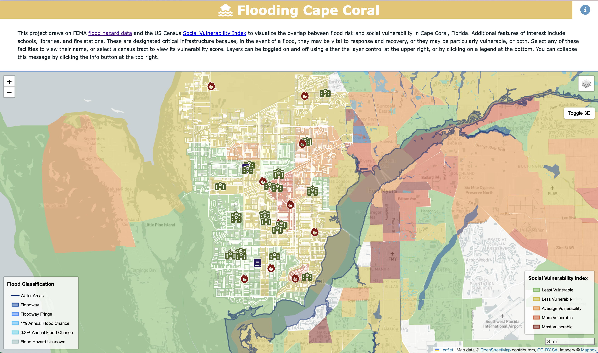

# Interactive Social Vulnerability and Flood Risk Visualization for Cape Coral, FL
## [Map Link](https://florida-flood-risk-master-d9cjkowie-haochenmiaos-projects.vercel.app/)

## Introduction

The "Interactive Social Vulnerability and Flood Risk Visualization" is a web-based GIS application designed to visualize and analyze social vulnerability indices and flood risk zones in Cape Coral, Florida. It features both 2D and 3D map visualizations with interactive overlays, popups, and tools for enhanced user engagement. This application aims to assist urban planners, policymakers, and community stakeholders in making data-driven decisions.

## Map Screenshots

### 2D Map



### 3D Map


## Features

* 2D and 3D Map Views: Switch seamlessly between 2D and 3D visualizations.
* Interactive Overlays: Enable or disable layers for social vulnerability indices, flood risks, and infrastructure (schools, libraries, fire stations).
* Popups and Tooltips: Display detailed information when interacting with map features.
* Custom Legends: Highlight data classifications, including social vulnerability and flood zone types.
* User Tools: Zoom, rotate, and navigate the map easily with built-in controls.

## Technology Stack
* Frontend: Leaflet.js, Mapbox GL JS, HTML5, CSS3, JavaScript
* Data Management: GeoJSON, CSV, Python
* Hosting: GitHub Pages
* Libraries/Tools:
    * Geopandas
    * Leaflet.js (v1.7.1)
    * Mapbox GL JS (v2.8.1)
    * Font Awesome for map icons

## System Requirements
* Browser Compatibility:
    * Chrome (v90+)
    * Firefox (v85+)
    * Safari
* Dependencies:
    * Node.js (for local development)
    * NPM (for managing packages)
* Internet Connection: Required for fetching map tiles from Mapbox and OpenStreetMap.


## Setup Instructions

### Step 1: Clone the Repository
```
git clone https://github.com/username/project.git
cd project
```

### Step 2: Install Dependencies
```
npm install
```

### Step 3: Add Your Mapbox API Key
Create a ```.env``` file in the project root directory and add your API key:

```
MAPBOX_ACCESS_TOKEN=your-api-key
```

### Step 4: Start the Application
```
npm start
```

The application will be available at http://localhost:3000.


project/
├── index.html        # Entry point for the application
├── styles.css        # Contains all CSS files
├── scripts.js        # Contains JavaScript files
├── Boundary.js       # Contains the city boundary data
├── Fire.js           # Contains the fire station data
├── Library.js        # Contains the libraries data
├── Roads.js          # Contains the roads and streets data
├── Schools.js        # Contains the schools data
├── SurfaceWater.js   # Contains the water area data
├── SVI.js            # Contains the social bulnerabiltiy index data
└── README.md         # Project documentation


## Data Sources
### Social Vulnerability Index (SVI)
* Provider: CDC/ATSDR
* Description: SVI measures the resilience of communities when confronted by external stresses on human health, such as natural disasters or disease outbreaks.
* Format: GeoJSON
* Use Case: Layer visualization in 2D and 3D maps.

### Flood Risk Zones

- **Provider**: FEMA  
- **Description**: The flood risk zones data is extracted from the National Flood Hazard Layer (NFHL) via FEMA's REST API.  
- **Acquisition Process**:  
  - Used the following query links from FEMA’s REST API:
    - [Zone A](https://hazards.fema.gov/arcgis/rest/services/public/NFHL/MapServer/28/query?where=FLD_ZONE=%27A%27&geometry=-82.0,26.5,-81.5,27.0&geometryType=esriGeometryEnvelope&spatialRel=esriSpatialRelIntersects&outFields=*&f=geojson)
    - [Zone AE - Density Fringe Area](https://hazards.fema.gov/arcgis/rest/services/public/NFHL/MapServer/28/query?where=FLD_ZONE=%27AE%27%20AND%20ZONE_SUBTY=%27DENSITY%20FRINGE%20AREA%27&geometry=-82.0,26.5,-81.5,27.0&geometryType=esriGeometryEnvelope&spatialRel=esriSpatialRelIntersects&outFields=*&f=geojson)
    - [Zone AE - General](https://hazards.fema.gov/arcgis/rest/services/public/NFHL/MapServer/28/query?where=FLD_ZONE=%27AE%27&geometry=-82.0,27.0,-81.5,27.5&geometryType=esriGeometryEnvelope&spatialRel=esriSpatialRelIntersects&outFields=*&f=geojson)
    - [Zone AE - Null Subtype](https://hazards.fema.gov/arcgis/rest/services/public/NFHL/MapServer/28/query?where=FLD_ZONE=%27AE%27%20AND%20ZONE_SUBTY%20IS%20NULL&outFields=*&resultRecordCount=1500&f=geojson)
    - [Zone AE - Floodway](https://hazards.fema.gov/arcgis/rest/services/public/NFHL/MapServer/28/query?where=FLD_ZONE=%27AE%27%20AND%20ZONE_SUBTY=%27FLOODWAY%27&geometry=-82.0,26.5,-81.5,27.0&geometryType=esriGeometryEnvelope&spatialRel=esriSpatialRelIntersects&outFields=*&f=geojson)
    - [Zone D](https://hazards.fema.gov/arcgis/rest/services/public/NFHL/MapServer/28/query?where=FLD_ZONE=%27D%27&geometry=-82.0,26.5,-81.5,27.0&geometryType=esriGeometryEnvelope&spatialRel=esriSpatialRelIntersects&outFields=*&f=geojson)
    - [Zone X - 0.2 PCT Annual Chance Flood Hazard](https://hazards.fema.gov/arcgis/rest/services/public/NFHL/MapServer/28/query?where=FLD_ZONE=%27X%27%20AND%20ZONE_SUBTY=%270.2%20PCT%20ANNUAL%20CHANCE%20FLOOD%20HAZARD%27&geometry=-82.0,26.5,-81.5,27.0&geometryType=esriGeometryEnvelope&spatialRel=esriSpatialRelIntersects&outFields=*&f=geojson)
    - [Area With Reduced Flood Risk Due to Levee](https://hazards.fema.gov/arcgis/rest/services/public/NFHL/MapServer/28/query?where=ZONE_SUBTY=%27AREA%20WITH%20REDUCED%20FLOOD%20RISK%20DUE%20TO%20LEVEE%27&geometry=-82.0,26.5,-81.5,27.0&geometryType=esriGeometryEnvelope&spatialRel=esriSpatialRelIntersects&outFields=*&f=geojson)
  - Query responses were downloaded in GeoJSON format.  
  - Data was preprocessed and styled using QGIS for integration into the application.

### Infrastructure Data
* Provider: Local Government and Open Data Portals
* Description: Includes schools, libraries, and fire station locations in Cape Coral.
* Format: GeoJSON
* Use Case: Layer visualization with custom icons.


## Usage Guide
1. Navigating the Map:
    * Use mouse drag or touch gestures to pan the map.
    * Scroll to zoom in and out.
2. Switching Views:
    * Click the "Toggle 3D" button to enable the 3D map view.
    * Use the toolbox to rotate and zoom the 3D map.
3. Interacting with Features:
    * Hover over map elements for tooltips.
    * Click on polygons (e.g., SVI zones) to view detailed popups.


## License
This project is licensed under the MIT License.


